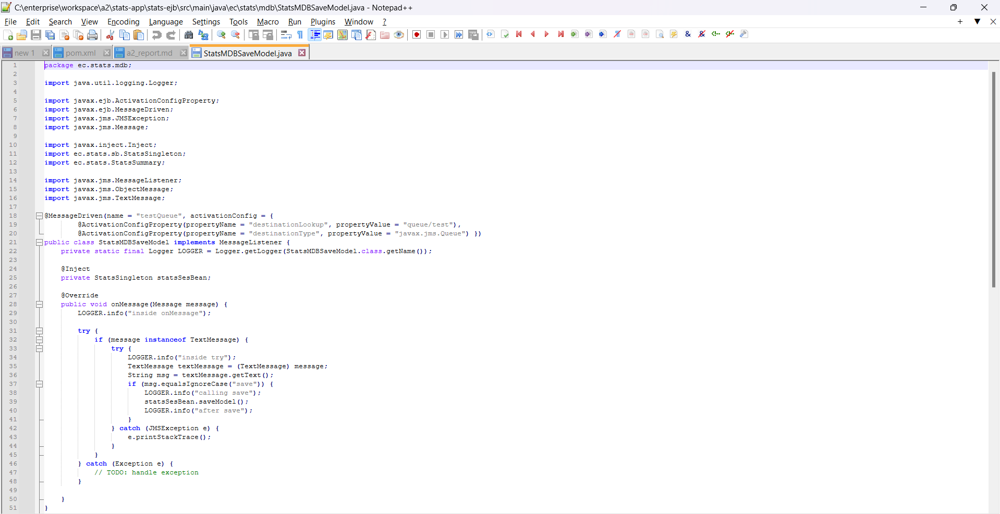
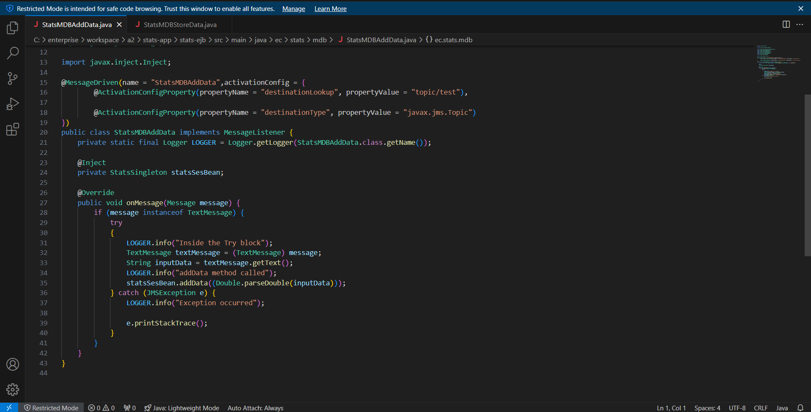
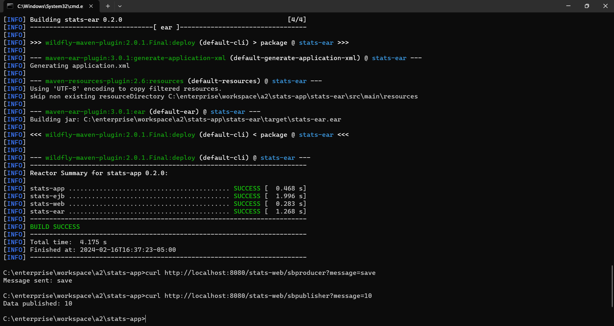

# A2 Report

Author: Vaibhav Thakur 

Date: 2024-02-15 

Check [readme.txt](readme.txt) for course work statement and self-evaluation. 
  
## Q1 JMS and MDB for Statistics Application (programming)

### Q1.1 Message Queue MDB

Complete? Yes 

{width=90%}

### Q1.2 Message Topic MDB

Complete? Yes

{width=90%}
{width=90%}

### Q1.3 JMS clients

Complete? Yes

{width=90%}

### Q1.4 JMS Clients within Servlet

Complete? Yes

{width=90%}

### Q1.5 JMS Clients within Session Beans 

Complete? Yes

{width=90%}
{width=90%}

## Q2 Data persistence for Statistics Application (programming)

### Q2.1 DB Client and CRUD Operations

Complete? Yes

{width=90%}

### Q2.2 User Entity Bean

Complete? Yes

{width=90%}

### Q2.3 Using User Entity Beans

Complete? Yes

{width=90%}

### Q2.4 Model Entity Bean

Complete? Yes 

{width=90%}

### Q2.5 Using Model Entity Bean

Complete? Yes

{width=90%}
{width=90%}

<!--If No, add a short description to describe the issues encountered.-->

## Q3 Batch test (test)

### Q3.1  Create test output

Complete? Yes

[test output](test_output.txt)

**References**

1. CP630 a2
