# A3 Report

Author: Vaibhav Thakur

Date: 2024-03-03 

Check [readme.txt](readme.txt) for course work statement and self-evaluation. 
  
## Q1 Web service project (programming)

### Q1.1 SOAP WS

Complete? Yes

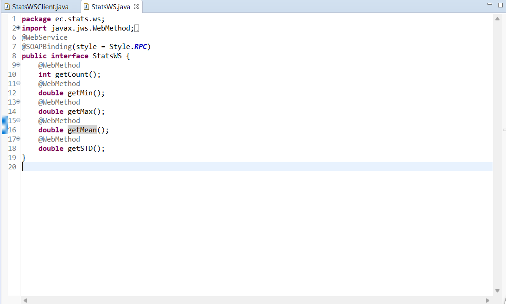{width=90%}
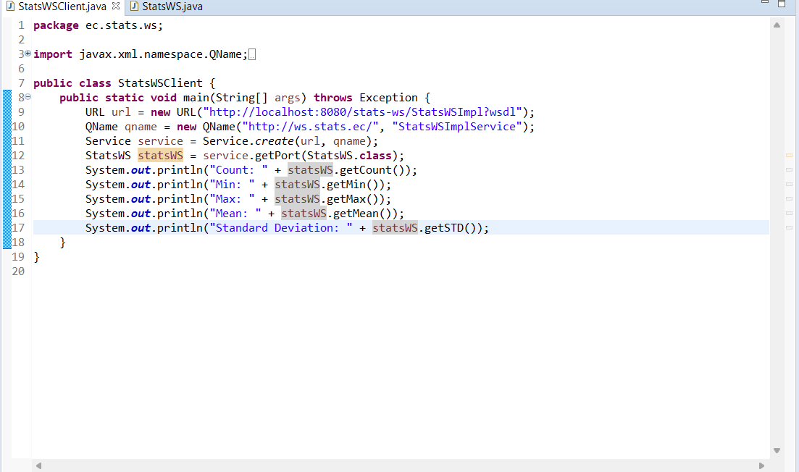{width=90%}
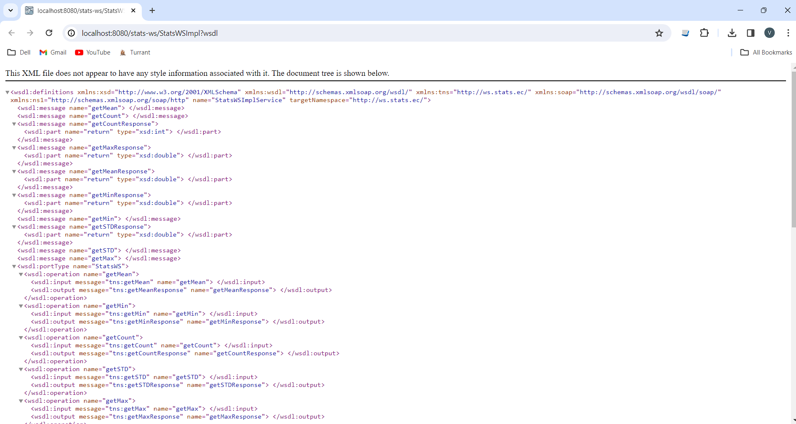{width=90%}

### Q1.2 SOAP WS clients

Complete? Yes

{width=90%}
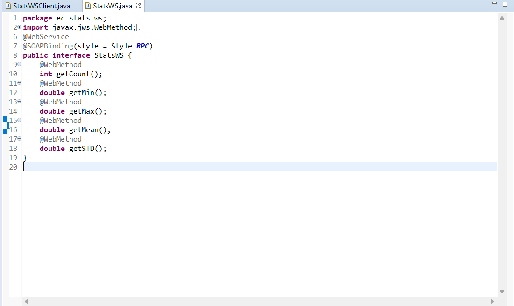{width=90%}
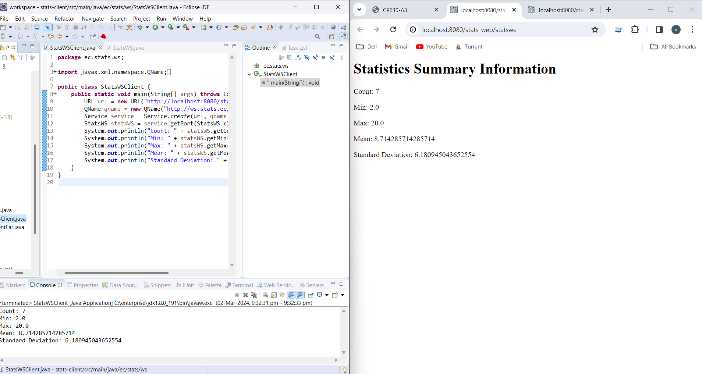{width=90%}

### Q1.3 RESTful Web service

Complete? Yes

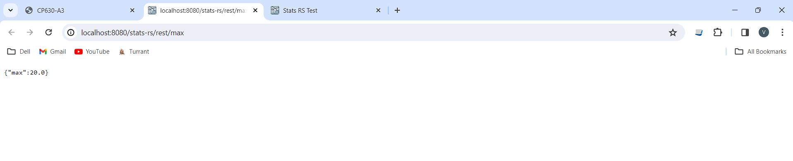{width=90%}
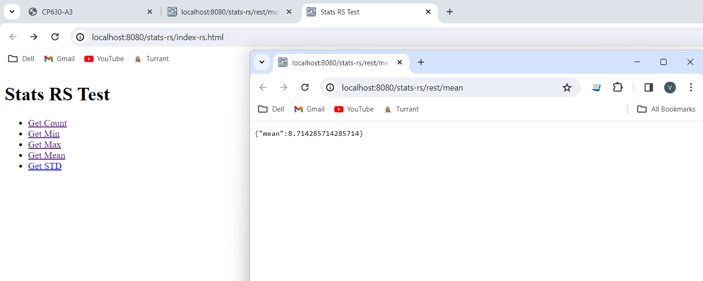{width=90%}

## Q2 Linear regression for EC (programming)

### Q2.1 Weka API programming

Complete? Yes

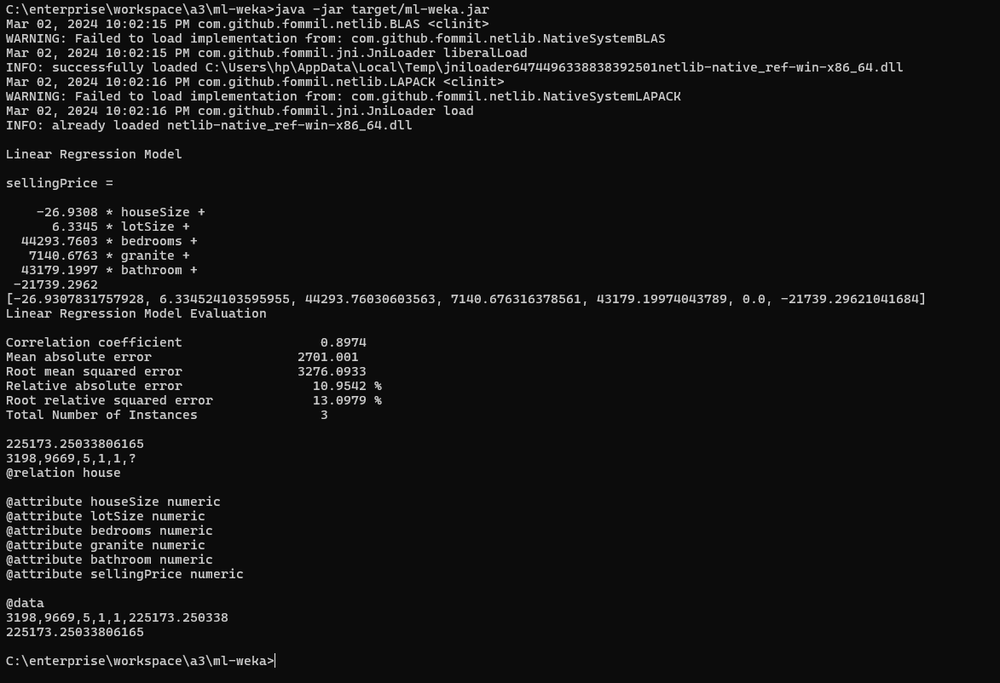{width=90%}
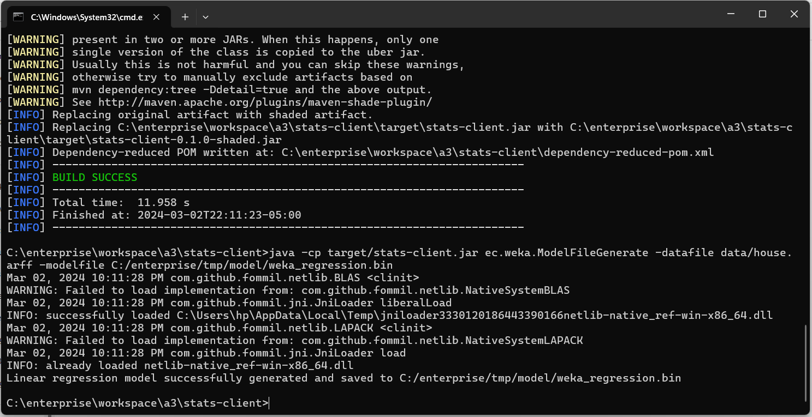{width=90%}
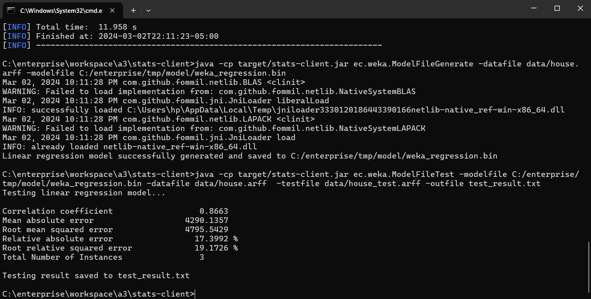{width=90%}
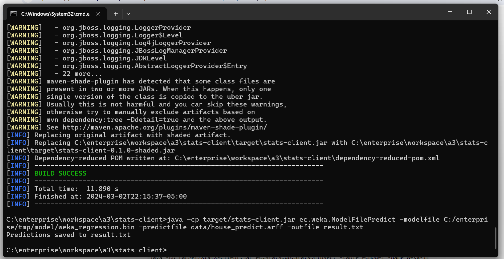{width=90%}
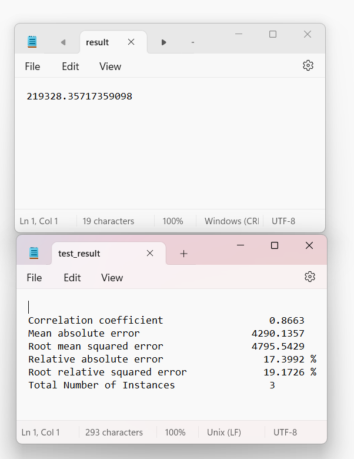{width=90%}

### Q2.2 LR Model in Database

Complete? Yes

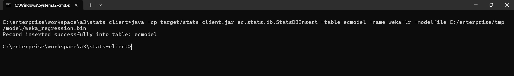{width=90%}
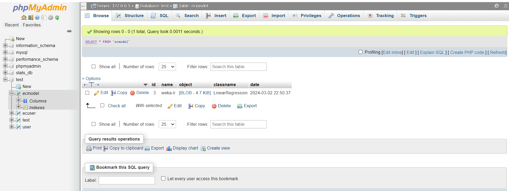{width=90%}
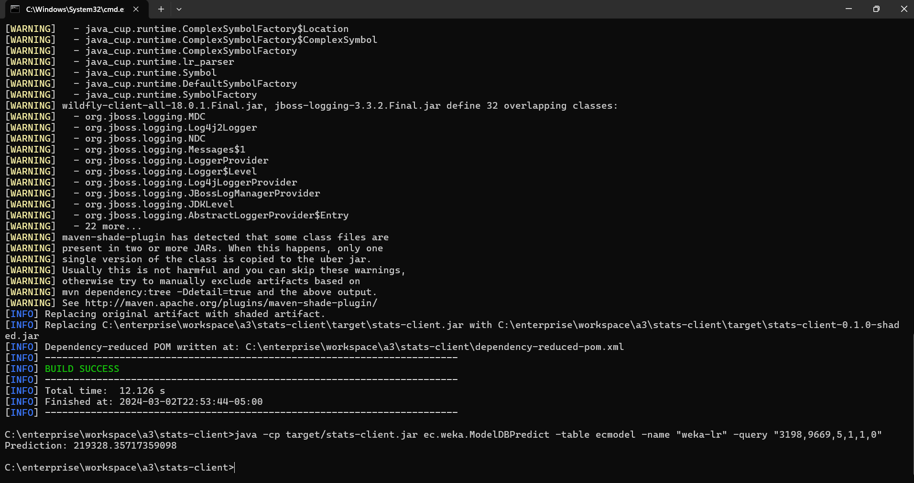{width=90%}

### Q2.3 LR Session Bean Component

Complete? Yes

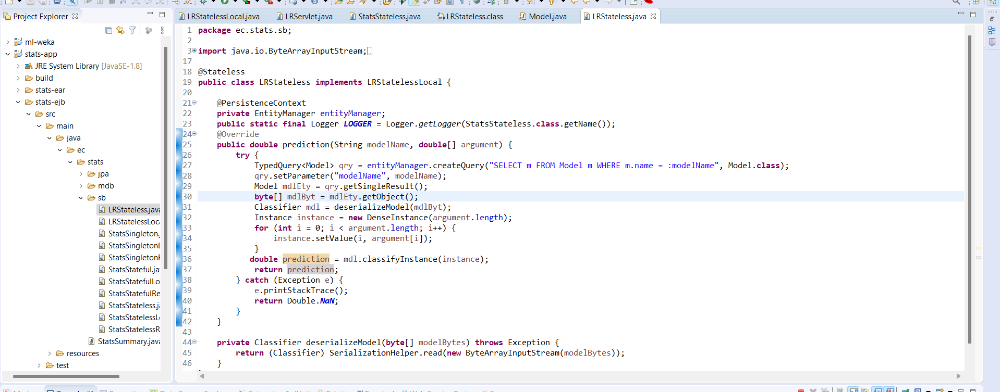{width=90%}
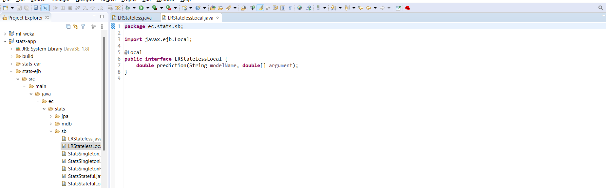{width=90%}

### Q2.4 LR Web Component 

Complete? Yes

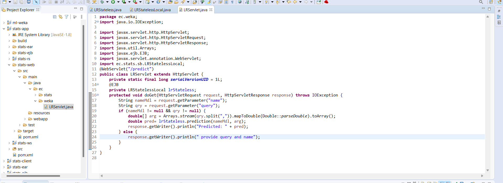{width=90%}
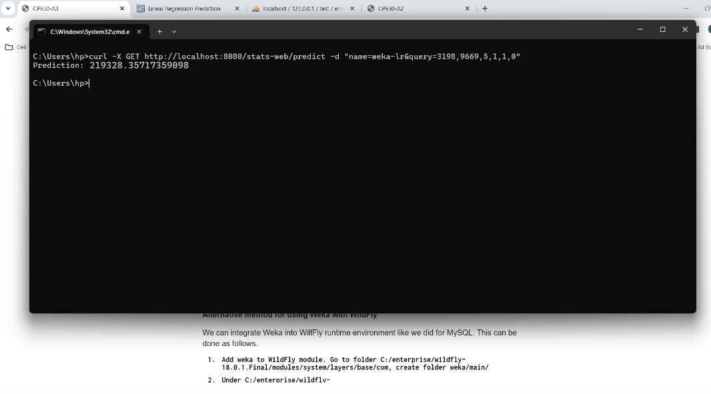{width=90%}
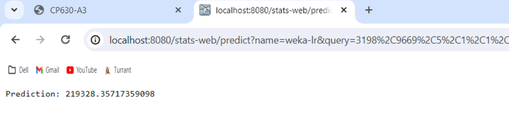{width=90%}

## Q3 Batch test (test)

### Q3.1  Create test output

Complete? Yes

[test output](test_output.txt)

**References**

1. CP630 a3