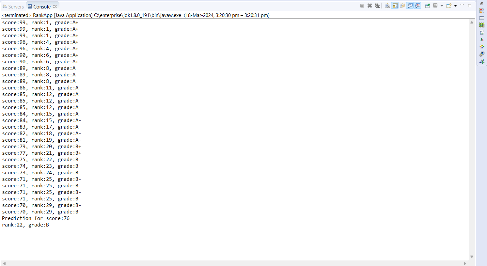
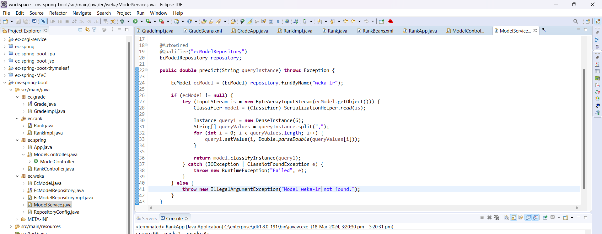

# A4 Report

Author: Vaibhav Thakur

Date: 2024-03-18 

Check [readme.txt](readme.txt) for course work statement and self-evaluation. 
  
## Q1 Spring Framework for EC (programming)

### Q1.1 Grade Spring Bean

Complete? Yes

{width=90%}
{width=90%}
{width=90%}
{width=90%}
{width=90%}

### Q1.2 Rank Spring Nean

Complete? Yes

{width=90%}
{width=90%}
{width=90%}
{width=90%}
{width=90%}

### Q1.3 Spring Micro-Service on Rank

Complete? Yes

{width=90%}
{width=90%}

### Q1.4 Spring Micro-Service on Linear Regression 

Complete? Yes

{width=90%}
{width=90%}
{width=90%}

## Q2 OSGi for EC (programming)

### Q2.1 stats-osgi-service

Complete? Yes

{width=90%}
{width=90%}
{width=90%}
{width=90%}
{width=90%}

### Q2.2 stats-osgi-consumer

Complete? Yes

{width=90%}

### Q2.3 stats-osgi-web

Complete? Yes

{width=90%}
{width=90%}

## Q3 Batch test (test)

### Q3.1  Create test output

Complete? Yes

[test output](test_output.txt)

**References**

1. CP630 a4
