# LAB0 Report

Author: Vaibhav Thakur 

Date: 19th January, 2024

Check [readme.txt](readme.txt) for course work statement and self-evaluation. 
  
# T1 Java JRE, JDK, Software Tools (lab practice)

### T1.1 Utility software
 

Complete? Yes 

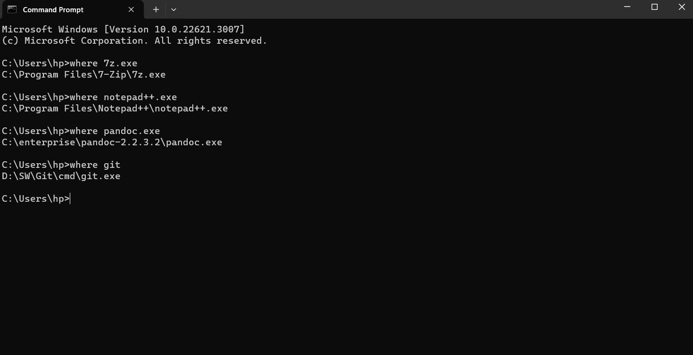{width=90%}

### T1.2 Java JRE and JDK
 

Complete? Yes

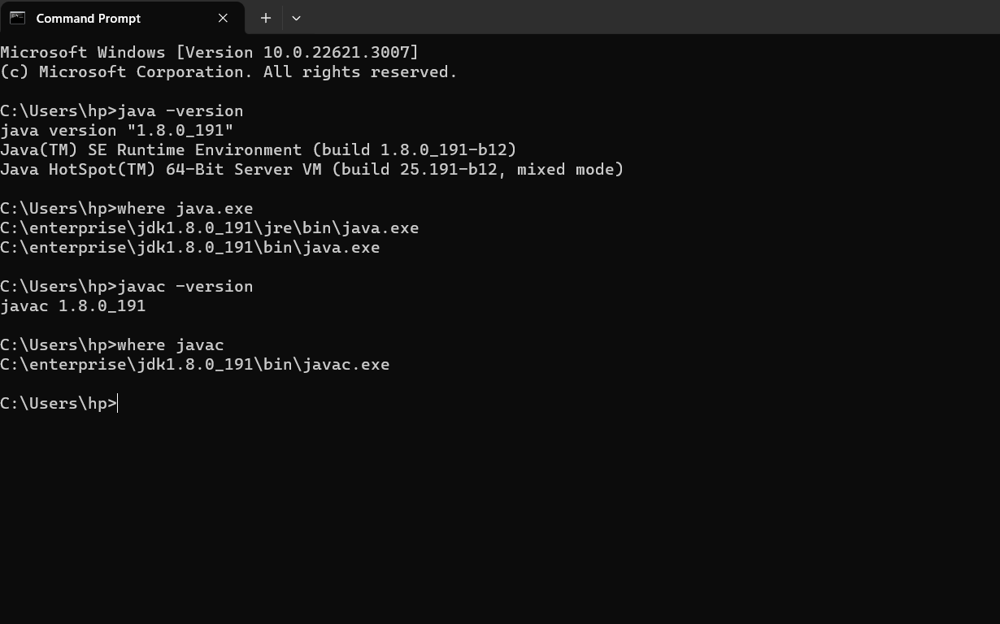{width=90%}

### T1.3 Apache Ant and Maven
 

Complete? Yes 

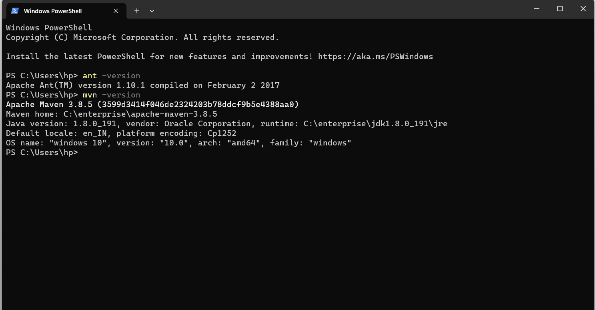{width=90%}

### T1.4 Eclipse JEE
 

Complete? Yes

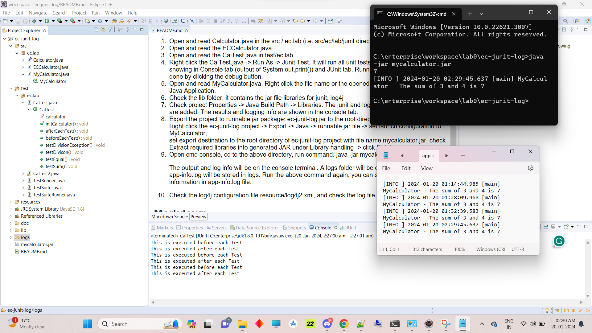{width=90%}

# T2 Warm up Maven projects (lab practice)

### T2.1 ec-junit-log-mvn
 

Complete? Yes 

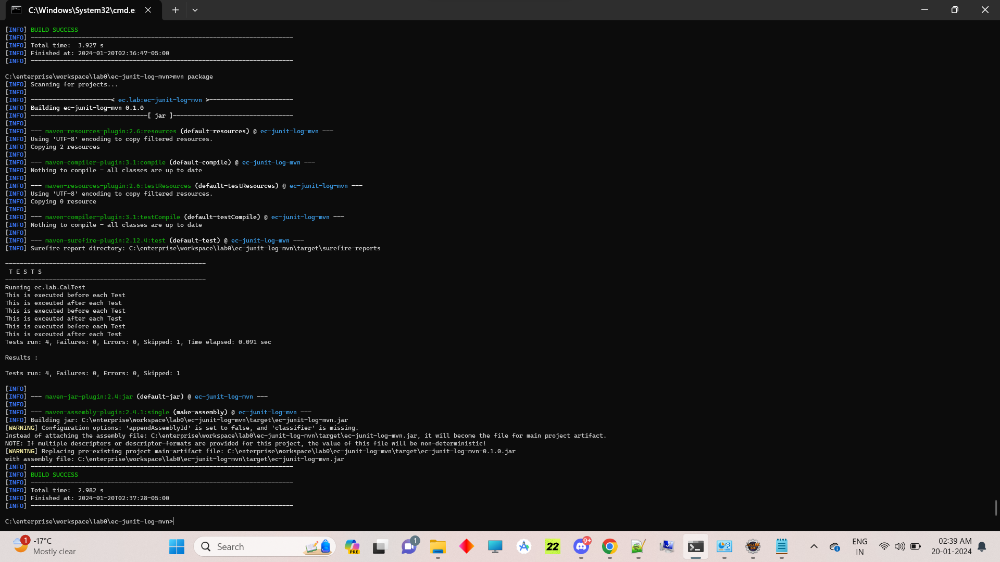{width=90%}

### T2.2 Create Maven project
 

Complete? Yes

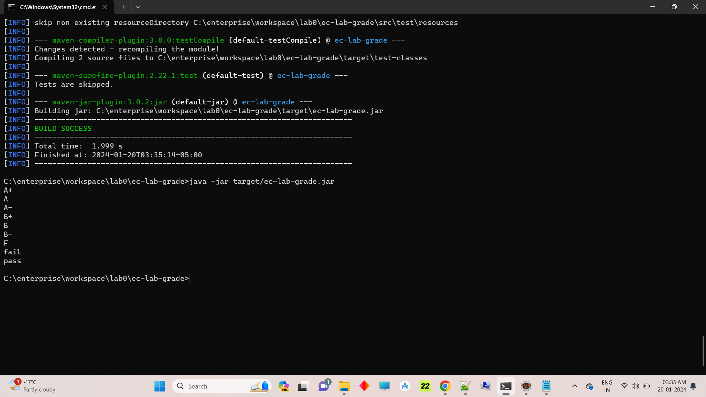{width=90%}

### T2.3 Maven project in Eclipse
 

Complete? Yes

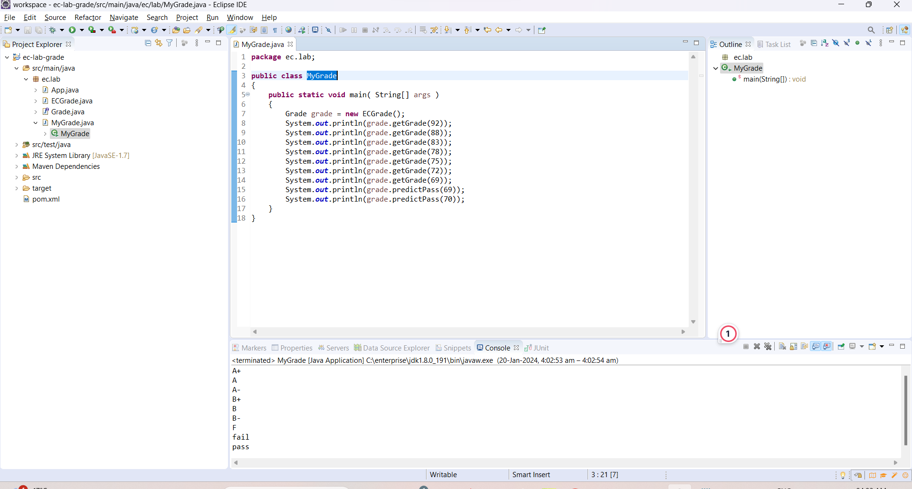{width=90%}

### T2.4 ec-file-io-mvn
 

Complete? Yes

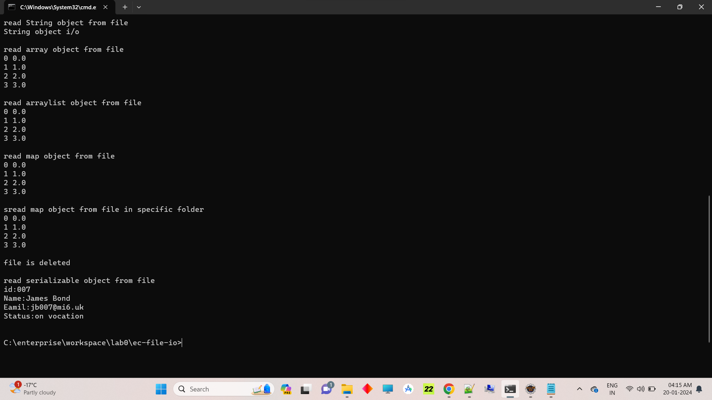{width=90%}

### T2.5 ec-stats
 

Complete? Yes

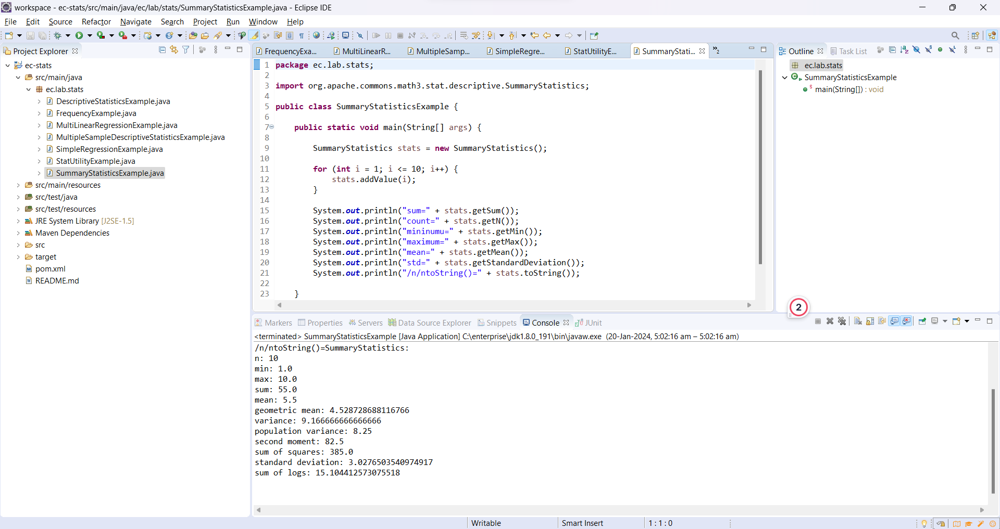{width=90%}

### T2.6 ec-regression
 

Complete? Yes

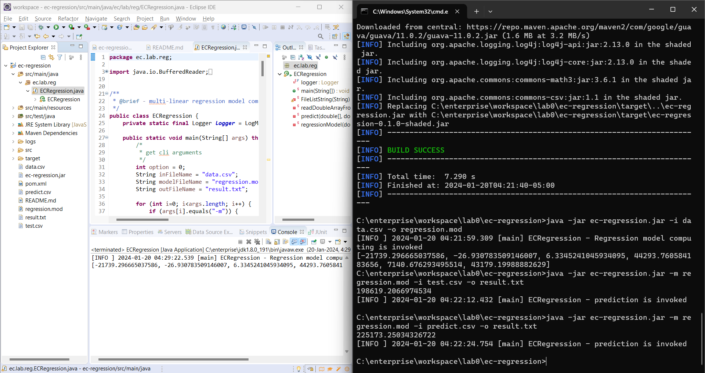{width=90%}

### T2.7 ec-annotation-reflection
 

Complete? Yes

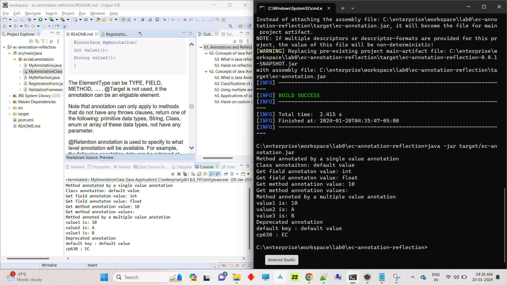{width=90%}

**References**

1. CP630 lab0
