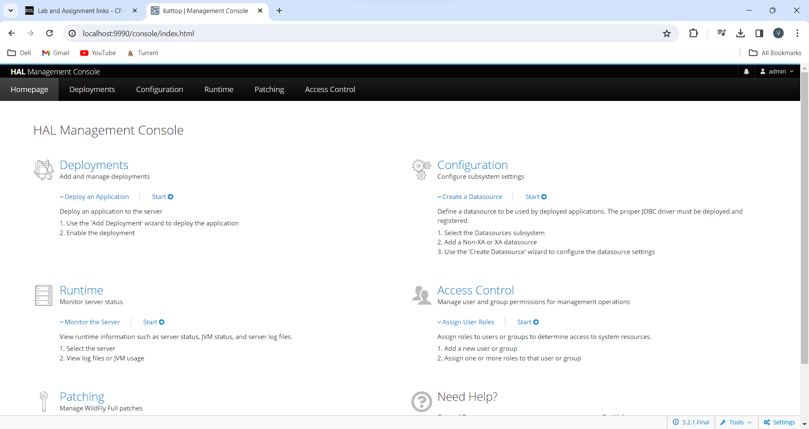
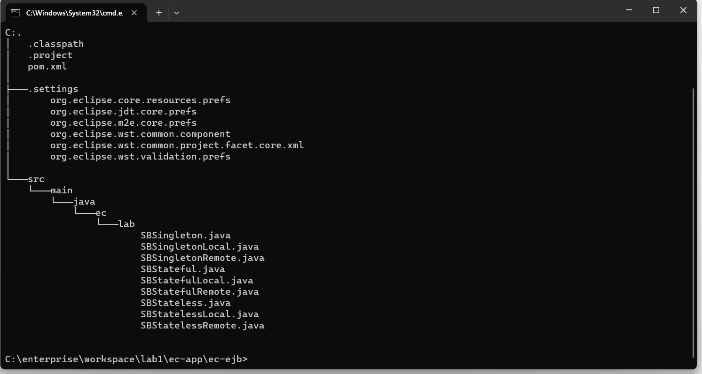

# LAB1 Report

Author: Vaibhav Thakur

Date: 01/27/2024

Check [readme.txt](readme.txt) for course work statement and self-evaluation. 
  
# T1 WildFly (JBoss-AS) (lab practice)

### T1.1 WildFly installation
 
Complete? Yes 

{width=90%}
{width=90%}

### T1.2 Set users
 
Complete? Yes

 

{width=90%}

 

# T2 Build and Deploy Applications by Maven (lab practice)

### T2.1 Install quickstart projects
 
Complete? Yes

 

{width=90%}
 

### T2.2 Testing helloworld project
 
Complete? Yes

 

{width=90%}
{width=90%}
{width=90%}
{width=90%}
{width=90%}

 

### T2.3 Testing ejb-remote project
 
Complete? Yes

{width=90%}

# T3 WildFly with Eclipse JEE (lab practice)

### T3.1 Eclipse with External WildFly
 
Complete? Yes

 

{width=90%}

 

### T3.2 WildFly within Eclipse
 
Complete? Yes

 

{width=90%}

 

### T3.3 ec-web Maven project
 
Complete? Yes

 

{width=90%}

 

# T4 JEE application project (lab practice)

### T4.1 ec-app project
 
Complete? Yes

 

{width=90%}

 

### T4.2 ec-ejb project
 
Complete? Yes

 

{width=90%}

 

### T4.3 ec-ejb-web project
 
Complete? Yes

 

{width=90%}

 

### T4.4 ec-ear project
 
Complete? Yes

 

{width=90%}

 

### T4.5 ec-app-client project
 
Complete? Yes

 

{width=90%}

 

### T4.6 Deploy ec-ejb with remote access
 
Complete? Yes

 

{width=90%}

 

**References**

1. CP630 lab1
