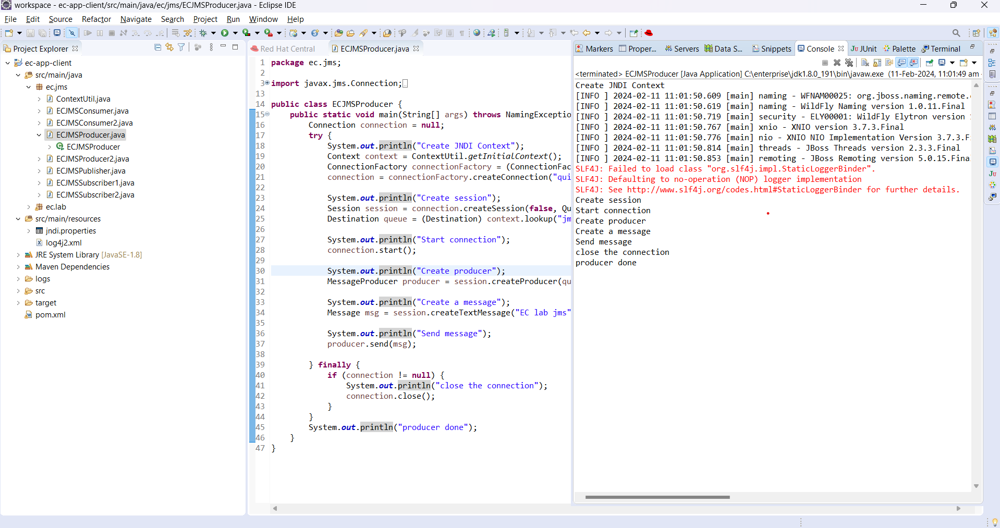

# LAB2 Report

Author: Vaibhav Thakur 

Date: 2024-02-11 

Check [readme.txt](readme.txt) for course work statement and self-evaluation. 
  
# T1 Java Message Service (JMS) (lab practice)

### T1.1 Hand on helloworld-jms
 

Complete? Yes

{width=90%}

### T1.2 JMS message queue programming
 
Complete? Yes

{width=90%}
{width=90%}

### T1.3 JMS topic programming
 
Complete? Yes 

{width=90%}

# T2 Message Driven Bean (MDB) (lab practice)

### T2.1 WildFly message within Eclipse
 
Complete? Yes 

{width=90%}

### T2.2 Hand on helloworld-mdb project 

Complete? Yes 

{width=90%}
{width=90%}

### T2.3 ec-ejb MDB components
 
Complete? Yes 

{width=90%}

### T2.4 JMS web clients
 
Complete? Yes

{width=90%}

# T3 Database Connection (lab practice)

### T3.1 H2 database
 
Complete? Yes

{width=90%}

### T3.2 MySQL database
 
Complete? Yes 

{width=90%}

### T3.3 JDBC client programming
 
Complete? Yes

{width=90%}

# T4 JPA and Hibernate (lab practice)

### T4.1 Hand on JPA example
 
Complete? Yes

{width=90%}

### T4.2 Hand on ec-jpa project
 
Complete? Yes

{width=90%}

# T5 Entity Beans (lab practice)

### T5.1 Entity Beans with embedded H2
 
Complete? Yes

{width=90%}

### T5.2 Entity Beans with standalone H2
 
Complete? Yes

{width=90%}

### T5.3 Entity Beans with MySQL
 
Complete? Yes

{width=90%}

### T5.4 ec-ejb entity components
 
Complete? Yes

{width=90%}

**References**

1. CP630 lab2
