# LAB3 Report

Author: Vaibhav Thakur

Date: 2024-03-02 

Check [readme.txt](readme.txt) for course work statement and self-evaluation. 
  
# T1 SOAP Web Services (lab practice)

### T1.1 Hand on helloworld-ws
 

Complete? Yes 

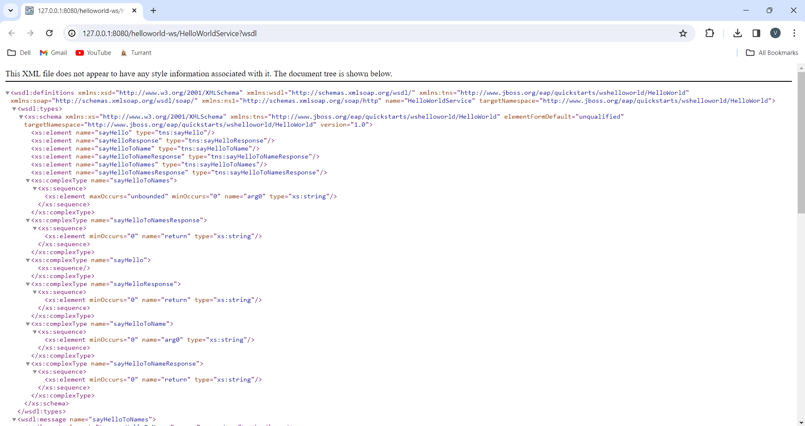{width=90%}
{width=90%}
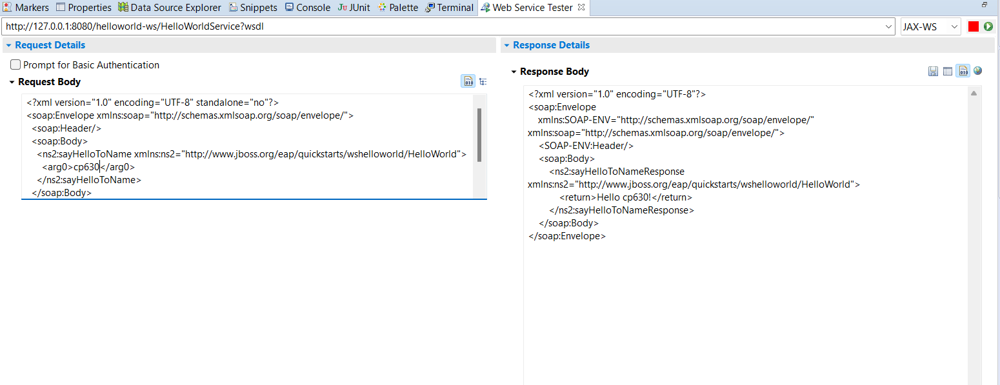{width=90%}
{width=90%}

### T1.2 ec-ws component
 

Complete? Yes 

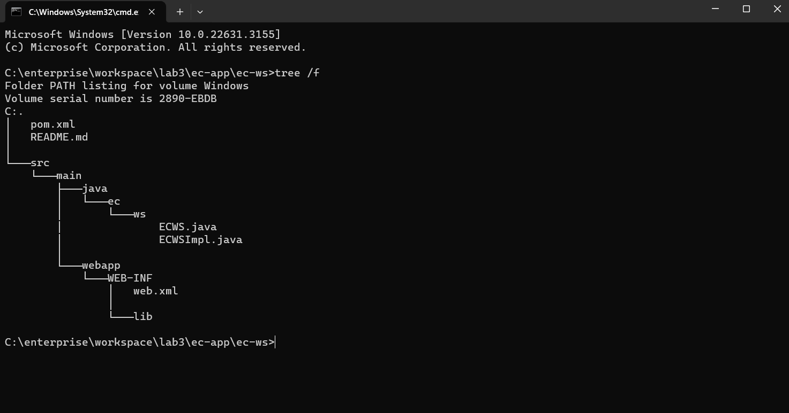{width=90%}
{width=90%}
{width=90%}

### T1.3 ec-ws client
 

Complete? Yes 

{width=90%}

### T1.4 Accessing SOAP WS by Servlet
 

Complete? Yes 

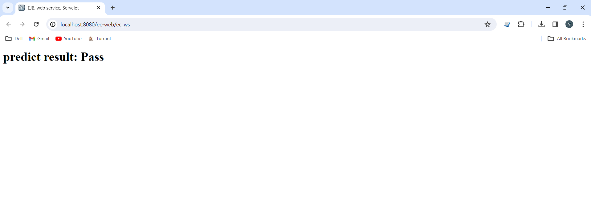{width=90%}

# T2 RESTful Web Services (lab practice)

### T2.1 Hand on helloworld-rs
 

Complete? Yes 

{width=90%}

### T2.2 ec-rs component
 

Complete? Yes 

{width=90%}
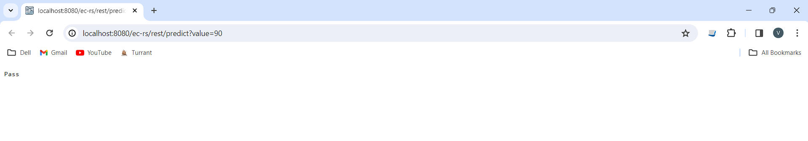{width=90%}

# T3 Web Tier Components (lab practice)

### T3.1 Servlet Programming
 

Complete? Yes 

{width=90%}
{width=90%}
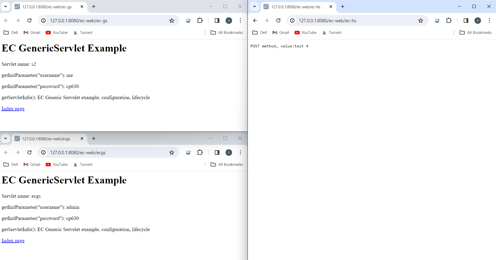{width=90%}
{width=90%}
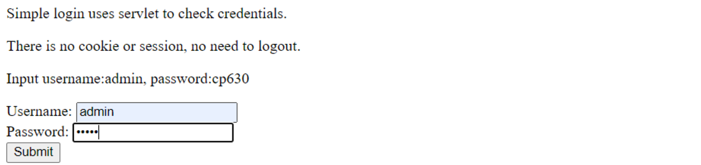{width=90%}

### T3.2 Hand on JSP
 

Complete? Yes 

{width=90%}
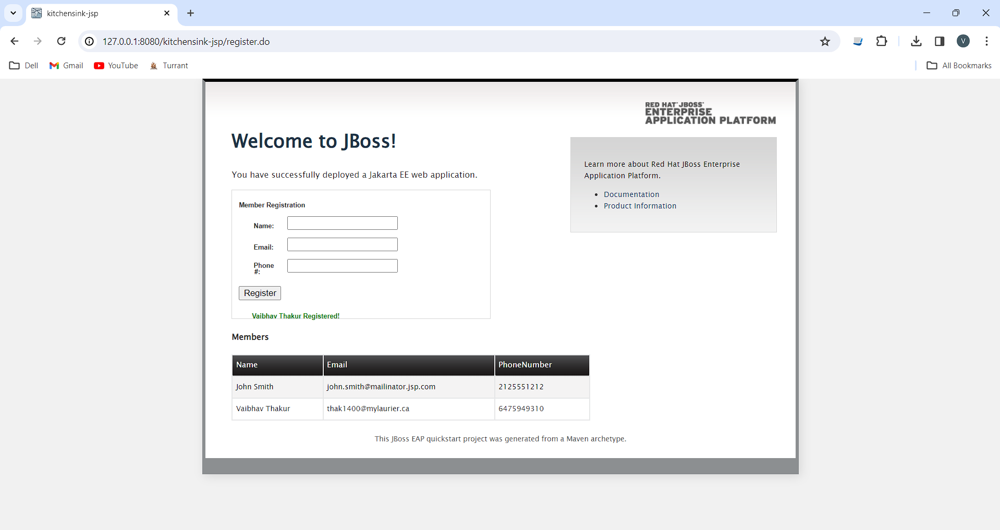{width=90%}
{width=90%}
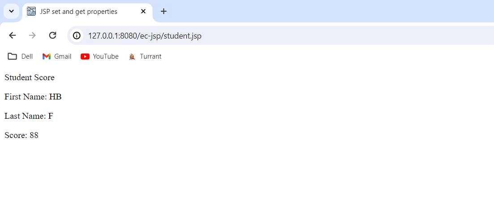{width=90%}
{width=90%}
{width=90%}

### T3.3 Hand on JSF
 

Complete? Yes 

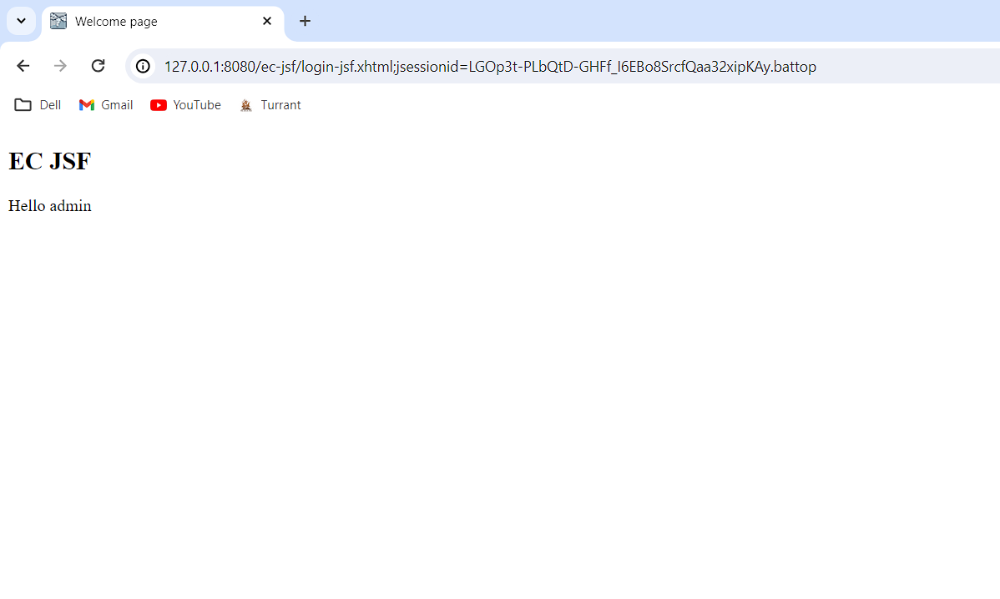{width=90%}
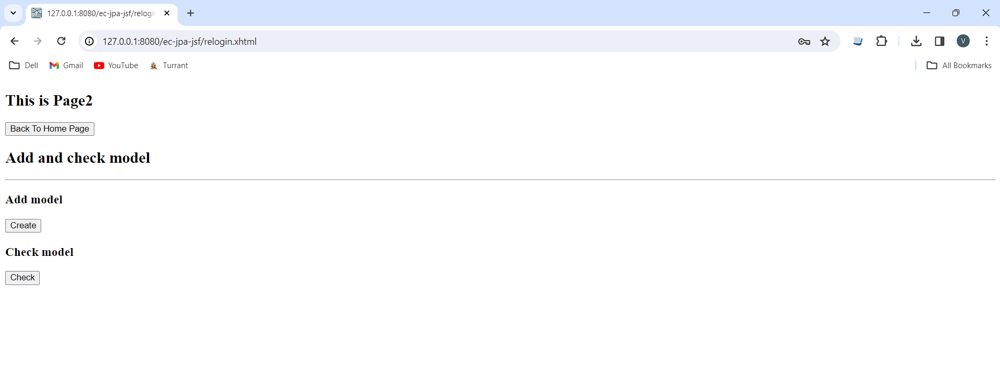{width=90%}

# T4 Client tier components (lab practice)

### T4.1 Java HTTP clients
 

Complete? Yes 

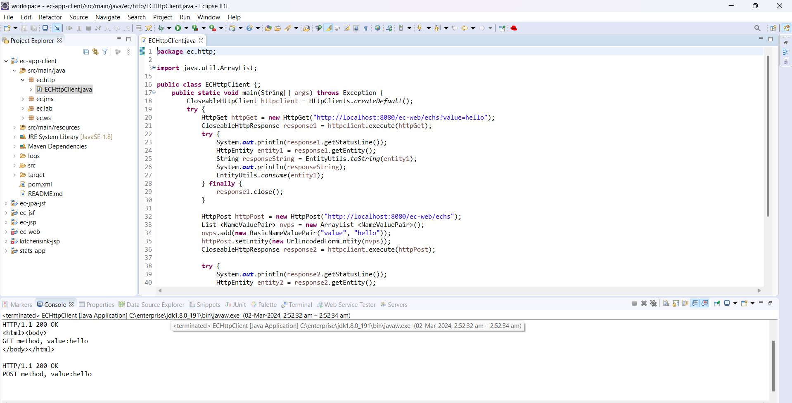{width=90%}

### T4.2 JavaScript Client
 

Complete? Yes 

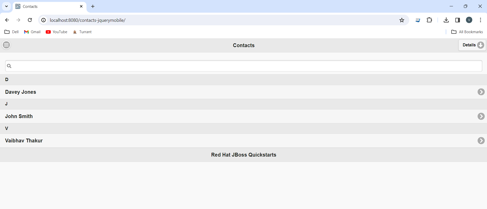{width=90%}
{width=90%}
{width=90%}

**References**

1. CP630 lab3