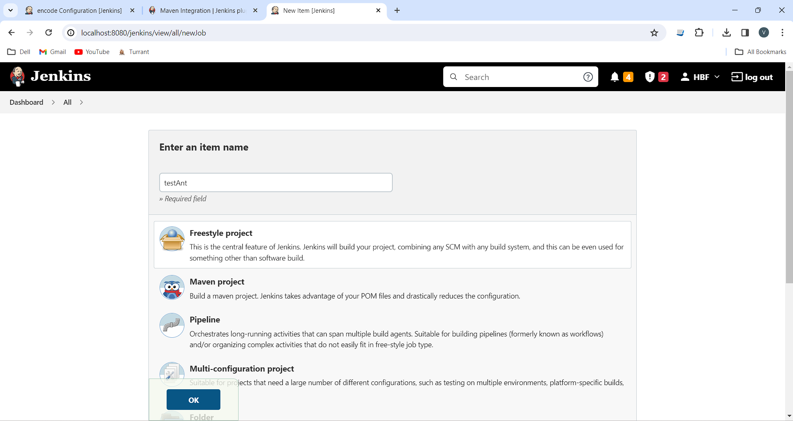
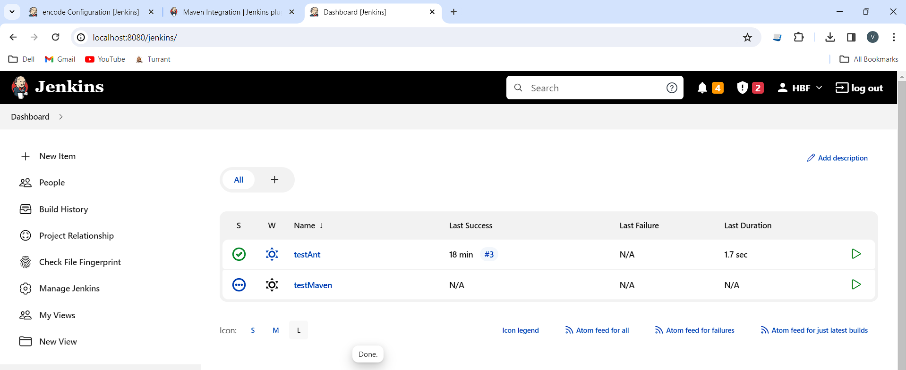

# LAB4 Report

Author: Vaibhav Thakur

Date: 2024-03-16 

Check [readme.txt](readme.txt) for course work statement and self-evaluation. 
  
# T1 Spring Framework (lab practice)

### T1.1 Hand on IoC
 

Complete? Yes 

{width=90%}
{width=90%}
{width=90%}
{width=90%}

### T1.2 Hand on AOP
 

Complete? Yes 

{width=90%}

### T1.3 Web component of Spring MVC
 

Complete? Yes 

{width=90%}
{width=90%}
{width=90%}
{width=90%}
{width=90%}
{width=90%}

### T1.4 Spring Boot Web applications
 

Complete? Yes 

{width=90%}
{width=90%}
{width=90%}
{width=90%}
{width=90%}

### T1.5 Spring on WildFly
 

Complete? Yes 

{width=90%}
{width=90%}
{width=90%}

# T2 OSGi Framework (lab practice)

### T2.1 Equinox OSGi framework
 

Complete? Yes 

{width=90%}
{width=90%}
{width=90%}
{width=90%}

### T2.2 Creating OSGi bundles
 

Complete? Yes 

{width=90%}
{width=90%}

### T2.3 Apache Felix
 

Complete? Yes 

{width=90%}
{width=90%}
{width=90%}

### T2.4 Apache Karaf
 

Complete? Yes 

{width=90%}
{width=90%}
{width=90%}

# T3 OSGi Service Bundle development (lab practice)

### T3.1 OSGi service bundle
 

Complete? Yes 

{width=90%}
{width=90%}

### T3.2 ec-osgi-consumer bundle
 

Complete? Yes 

{width=90%}

### T3.3 Servlet bundles
 

Complete? Yes 

{width=90%}
{width=90%}

# T4 Docker (lab practice)

### T4.1 Install Docker and operations
 

Complete? Yes 

{width=90%}
{width=90%}
{width=90%}
{width=90%}
{width=90%}
{width=90%}
{width=90%}
{width=90%}

### T4.2 Creating docker images
 

Complete? Yes 

{width=90%}
{width=90%}
{width=90%}
{width=90%}
{width=90%}
{width=90%}
{width=90%}

# T5 Container orchestration (optional, no marks) (lab practice)

### T5.1 Install and run Microk8s
 

Complete? No
<!-- If No, Optional step-->

### T5.2 Basic operations on Microk8s
 

Complete? No 
<!-- If No, Optional step-->

# T6 Hand on Jenkins (lab practice)

### T6.1 Jankins Installation and configuration
 

Complete? Yes 

{width=90%}
{width=90%}
{width=90%}
{width=90%}
{width=90%}
{width=90%}

### T6.2 Creating Jenkins Jobs
 

Complete? Yes 

{width=90%}
{width=90%}
{width=90%}
{width=90%}
{width=90%}
{width=90%}
{width=90%}
{width=90%}
{width=90%}
{width=90%}
{width=90%}
{width=90%}
{width=90%}
{width=90%}

**References**

1. CP630 lab4
